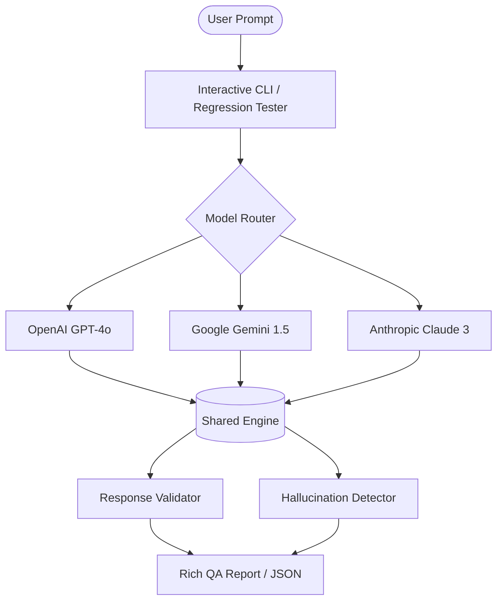

# 🧰 AI-QA-Toolkit

A comprehensive suite for AI Quality Assurance, including response validation, hallucination detection, and multi-model regression testing.



---

## 📂 Toolkit Structure

| Module | Description | Day |
|---|---|---|
| `01_Response_Validator` | Interactive & CLI based model validation | Day 1 |
| `02_Hallucination_Detector` | Standalone hallucination pattern scanner | Day 2 |
| `03_Regression_Tester` | Multi-model behavior comparison tool | Day 3 |
| `shared/` | Shared AI clients and validation logic | Day 4 |
| `reports/` | Sample QA results and performance data | Day 6 |


## Features

| Check | What It Does |
|---|---|
| 🔁 **Consistency** | Compares 2+ responses for semantic similarity using TF-IDF cosine similarity |
| 🚨 **Hallucination Detection** | Flags overconfident claims, fake statistics, and hedged guesses |
| 📊 **Confidence Scoring** | Scores response quality 0–100 across 5 dimensions |

---

## Installation

```bash
cd "AI QA Script"
pip install -r requirements.txt
```

**Requirements:** Python 3.8+ | `scikit-learn` | `numpy` | `colorama`

---

## Usage

### 1. Interactive Multi-AI Mode (OpenRouter Support! 🚀)
Type a prompt and compare responses from **GPT, Gemini, Llama 3, and DeepSeek** using just ONE key.

```bash
# Compare Gemini and Llama-3 automatically
python 01_Response_Validator/interactive.py --ais or llama
```
*Tip: Use `--ais gpt gemini` to select specific models.*

### 2. Auto-Automation (Batch Mode) ⚡
Run multiple prompts from a file without any manual entry. Perfect for real QA.

```bash
python 03_Regression_Tester/regression_tester.py --batch prompts.json
```

### 2. Test consistency of two responses (Manual)
```bash
python cli.py --responses samples/resp1.txt samples/resp2.txt --prompt "What is gravity?"
```

### Test a single response for hallucination + confidence
```bash
python cli.py --inline "AI is always 100% accurate, studies prove this." --single
```

### Test with a hallucination sample
```bash
python cli.py --responses samples/resp_hallucination.txt --single
```

### Save a JSON report
```bash
python cli.py --responses samples/resp1.txt samples/resp2.txt --output report.json
```

### Override consistency threshold
```bash
python cli.py --responses r1.txt r2.txt --threshold 0.85
```

---

## CLI Arguments

| Argument | Short | Description |
|---|---|---|
| `--responses FILE...` | `-r` | One or more response text file paths |
| `--inline TEXT` | `-i` | Paste response text directly |
| `--prompt TEXT` | `-p` | Original prompt (optional context) |
| `--single` | `-s` | Skip consistency check (single response mode) |
| `--output FILE` | `-o` | Save JSON report to file |
| `--threshold FLOAT` | `-t` | Consistency similarity threshold (default: 0.75) |

---

## Output Example

```
╔══════════════════════════════════════════════════════════╗
║          🤖  AI RESPONSE QUALITY VALIDATOR               ║
╚══════════════════════════════════════════════════════════╝

═══ 🔁 CONSISTENCY CHECK ═══════════════════════════════════
  Verdict         : ✅ CONSISTENT
  Avg Similarity  : 0.8423  (threshold: 0.75)
  Responses       : 2

  Pair         Score      Status
  ──────────── ────────── ────────────
  R1  ↔  R2   0.8423     ✅ Similar

═══ 🚨 HALLUCINATION DETECTION ═════════════════════════════
  [Response 1]  Risk: ✅ LOW  |  Score: 0  |  Flagged: 0/9 sentences

═══ 📊 CONFIDENCE SCORES ════════════════════════════════════
  [Response 1]  Score: 82.0/100  Grade: 👍 B  Verdict: RELIABLE  Words: 127
    Breakdown:
      length_score        : ███████████████ 20.0/20
      structure_score     : ██████░░░░░░░░░ 8.0/20
      ...

══════════════════════════════════════════════════════════════
  Overall Verdict : ✅  PASS
══════════════════════════════════════════════════════════════
```

---

## JSON Report Format

```json
{
  "prompt": "What is gravity?",
  "overall_verdict": "PASS",
  "num_responses": 2,
  "consistency": {
    "verdict": "CONSISTENT",
    "average_similarity": 0.8423,
    "pairwise_scores": [{"pair": [1, 2], "score": 0.8423}]
  },
  "hallucination": [
    {"risk_level": "LOW", "risk_score": 0, "matches": [], "flagged_sentences": 0}
  ],
  "confidence": [
    {"score": 82.0, "grade": "B", "verdict": "RELIABLE", "word_count": 127}
  ]
}
```

---

## How Scoring Works

### Consistency (0–1)
Uses **TF-IDF cosine similarity** across all response pairs. A score ≥ 0.75 (configurable) means `CONSISTENT`.

### Hallucination Risk (LOW / MEDIUM / HIGH)
Detects 3 pattern categories:
- **Overconfident** — "always", "never", "100%", "proven fact" → 2 pts each
- **Suspicious Numeric** — fabricated stats with no citation → 3 pts each
- **Hedged Guess** — "I believe X is...", "I'm pretty sure" → 1 pt each

Score 0–2 = LOW, 3–6 = MEDIUM, 7+ = HIGH

### Confidence Score (0–100)
5 equal components, each worth up to 20 points:
| Component | Measures |
|---|---|
| Length | Penalises too-short (<30 words) or too-long (>600 words) responses |
| Structure | Rewards paragraphs, bullet lists, numbered lists, headings |
| Hedging | Rewards healthy epistemic uncertainty (1–4 hedge phrases) |
| Clarity | Penalises ALL CAPS words and repeated punctuation (`!!`, `??`) |
| Completeness | Checks response ends properly, not truncated |

### Overall Verdict
- `PASS` — All checks green
- `WARN` — Medium hallucination risk or low confidence
- `FAIL` — Inconsistent responses, HIGH hallucination, or unreliable confidence

---

## Exit Codes (for CI/CD)

| Code | Meaning |
|---|---|
| `0` | PASS |
| `1` | WARN |
| `2` | FAIL |

---

## Project Structure

```
AI-QA-Toolkit/
├── 01_Response_Validator/
│   ├── interactive.py   # Main demo script
│   └── cli.py           # Command line validator
├── 02_Hallucination_Detector/
│   └── hallucination_demo.py
├── 03_Regression_Tester/
│   └── regression_tester.py # Batch Automation tool
├── shared/
│   ├── ai_clients.py    # Multi-AI Engine
│   ├── ai_qa_validator.py # Core Scorer
│   └── report.py        # Visual Reports
├── prompts.json         # Batch input file
├── requirements.txt
└── .env                 # API Keys
```

---

## License

MIT — Free to use, extend, and modify.
